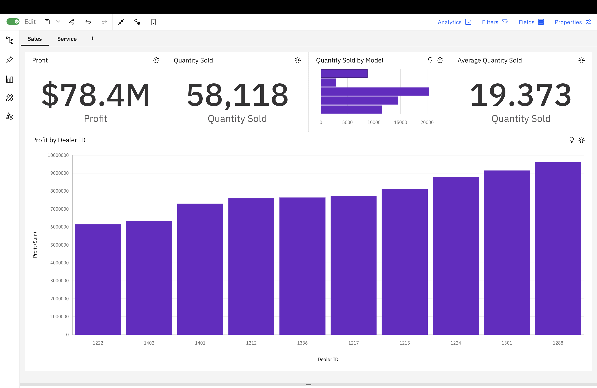
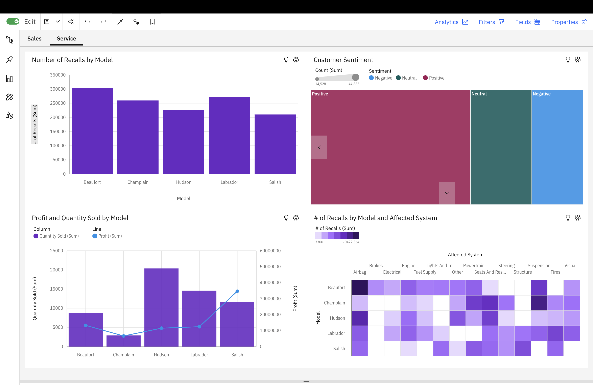

# Car Sales Performance Dashboard

## Overview
An interactive business intelligence dashboard built using IBM Cognos 
Analytics to analyze car sales and service data across multiple dealers 
and models.

## Dashboard Highlights
**Sales Tab**
- Total Profit: $78.4M across all dealers
- Total Quantity Sold: 58,118 units
- Profit breakdown by Dealer ID
- Quantity sold comparison by car model

**Service Tab**
- Recall analysis by model (Beaufort, Champlain, Hudson, Labrador, Salish)
- Customer sentiment analysis (Positive/Neutral/Negative)
- Profit vs Quantity correlation by model
- Recall heatmap by model and affected system

## Tools Used
- IBM Cognos Analytics
- Microsoft Excel (data source)

## Dataset
The dataset contains car sales records including dealer performance, 
model-level sales, profit margins, service recalls, and customer 
sentiment scores.

## Screenshots

